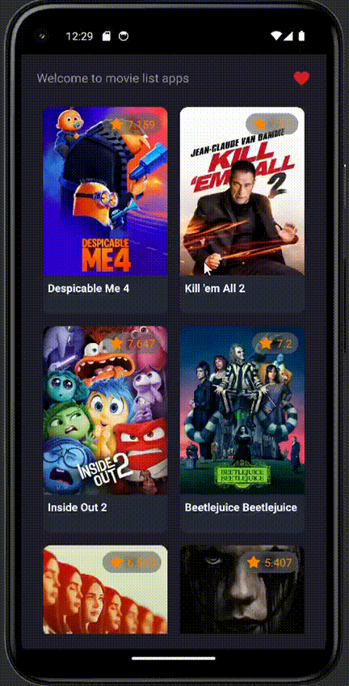

## HaiFlix

## Sneack peek Our App

  
  
  

## Features
- Get All Movies
- Detail Movies
- Add Favorites 
- Favorite

## Tech Stack
- MVVM (Model-View-ViewModel) Architecture Pattern
- Modularization (core module)
- Dynamic Feature (favorite module)
- Clean Architecture (data, domain, presentation)
- Dependency Injection with Dagger Hilt
- Coroutines Flow
- ViewBinding
- Room Persistence
- RawQuery